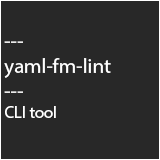

<div align="center">
  
  <br>
  <br>
  <p>
    <b>yaml-fm-lint</b>
  </p>
  <p>
     <i>NodeJS linter for YAML front matter in markdown files</i>
  </p>
  <p>

<!--  -->


  </p>
</div>

---

**Content**

- [What is this?](#what-is-this)
- [Features](#features)
- [Install](#install)
- [Usage](#usage)
- [Configuration](#configuration)

## What is this

An opinionated CLI NodeJS script which extracts yaml front matter from markdown files, lints the extracted data based on a config file and, if required, fixes most issues regarding the yaml.

## Features

- **Quick** - Only has two light-weight dependencies and lints directories asyncronously.
- **Configurable** - Lints the extracted data based on a config file.
- **Tiny** - Barely takes up space in your project.

## Install

You can either install the package as a devDependency with
```sh
npm i -D yaml-fm-lint
```
```sh
yarn add yaml-fm-lint -D
```
or use it directly with 
```sh
npx yaml-fm-lint <path>
```

## Usage

Include the script in your `package.json` file:

```json
"scripts": {
  "fmlint": "yaml-fm-lint"
}
```

Then run the script:

```sh
npm run fmlint -- path/to/your/markdown/files
```
```sh
yarn run fmlint -- path/to/your/markdown/files
```

You can provide additional arguments:
- `--fix`: Automatically fix the errors.
- `--config`: Path to the config file if not in root directory of project.
- `-r, --recursive`: *(default: `false`)* Recursively lint all files in the given directory.
- `-m, --mandatory`: *(default: `true`)* If set to false will show warnings instead of errors if no front matter is found.
- `-q, --quiet`: *(default: `false`)* If set to true will not show erroneous code snippets.
- `-o, --oneline`: *(default: `false`)* If set to true will condense error messages to one line, skipping snippets.
- `-c, --colored`: *(default: `true`)* If set to false will not color the output.

### Example:
```sh
npm run fmlint -- docs --config="src/configs/.yaml-fm-lint.json" -r --oneline --colored=false
```
This command would recursively look for all markdown files in the `docs` directory and lint them based on the `.yaml-fm-lint.json` config file located under `src/configs/`. The output would not be colored and would not show code snippets.

## Configuration

### `.yaml-fm-lint.json`

[Default config file](https://github.com/leneti/yaml-fm-lint/blob/main/config/default.json)

| Property name      | default | description                                                                                                                       |
|--------------------|---------|-----------------------------------------------------------------------------------------------------------------------------------|
| excludeDirs        | [See default config](https://github.com/leneti/yaml-fm-lint/blob/main/config/default.json)   | An array of directories to exclude from linting (🛑You should not overwrite this in your config unless you know what you are doing) |
| extraExcludeDirs   | `[]`      | Additional array of directories to exclude from linting.                                                                       |
| extensions         | `[".md"]` | Array of extensions of files to parse.                                                                              |
| includeDirs        | `[]`      | Array of directories to include in linting.                                                                                    |
| requiredAttributes | `[]`      | Array of attributes that must be present in the yaml front matter.                                                             |
| mandatory          | `true`    | If set to false will show warning instead of error if no front matter is found.                                                 |

### `.yaml-fm-lint.js`

You will have to default export the config object.

#### Custom linters

In addition to the default config you can also add your own custom linters. These will be executed after the default linters.

The functions receive an object with the following properties:
- `frontMatter` - The yaml front matter as a JavaScript object
- `showOneline` - Function to call one-line error messages Receives the following arguments:
  - `type` - "Error" or "Warning"
  - `message` - The error message
  - `affected` - This can either be a `string` or an array of `objects` with `row` and `col` values for precise error locations
- `rawFm` - The raw yaml front matter string. Includes lines with `---` dashes

```js
/**
 * @param {{frontMatter: Object, showOneline: (type: "Error" | "Warning", message: string, affected: string | {row: number, col: number, snippet?: string}[]) => void, rawFm: string}} param0
 * @returns {{errors: number, warnings: number}}
 */
function lowercaseTags({ frontMatter, showOneline }) {
  const tags = frontMatter.tags;
  let errors = 0;

  tags.forEach((tag) => {
    if (tag.toLowerCase() !== tag) {
      showOneline("Error", "tags must be lowercase", tag);
      errors++;
    }
  });

  return { errors, warnings: 0 };
}

module.exports = {
  extraLintFns: [lowercaseTags],
  requiredAttributes: ["tags"],
};
```